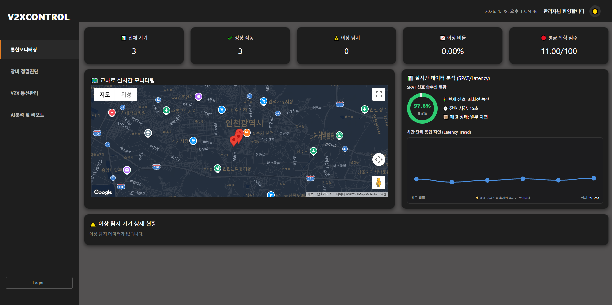
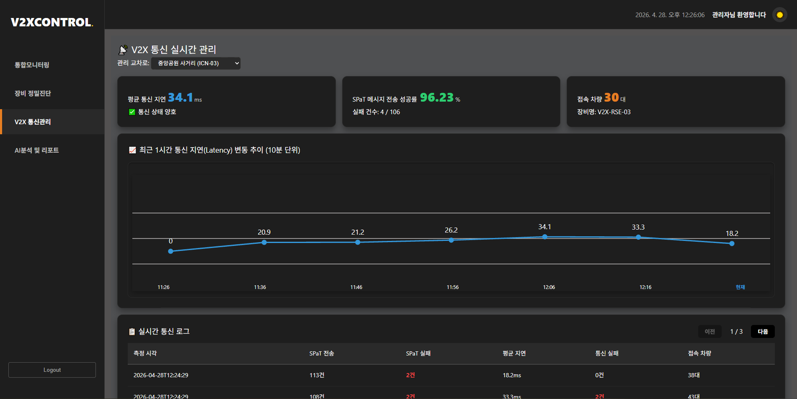
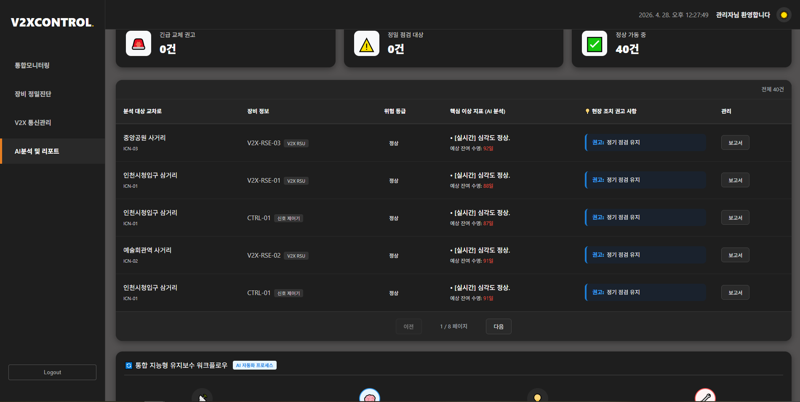

# 📡 V2X_PDM_Portfolio

> **V2X 데이터 기반 예지보전(PDM) 시스템 — 프론트엔드 포트폴리오**
> Vue.js + Chart.js로 구현한 실시간 데이터 시각화 대시보드

---

## 🎯 What & Why

| | |
|---|---|
| **무엇을** | V2X(Vehicle-to-Everything) 통신 데이터를 분석하여 차량/시스템 상태를 시각화하는 예지보전 대시보드 |
| **왜 만들었나** | 실시간 데이터 기반 이상 징후 조기 감지로 사전 예방 정비 실현 |
| **핵심 가치** | 복잡한 V2X 데이터를 직관적인 그래프 UI로 전환하여 운영자의 의사결정 지원 |

---

## 🖥 실행 화면

| 메인 대시보드 | V2X 통신 관리 | AI 분석 리포트 |
|:---:|:---:|:---:|
|  |  |  |

---

## 🏗 Architecture

V2X_PDM_Portfolio/
├── Front-end/     # Vue.js SPA
│   └── src/
│       ├── views/
│       │   ├── DashboardView.vue   # 실시간 데이터 대시보드
│       │   ├── V2xView.vue         # V2X 통신 현황
│       │   └── AiReportView.vue    # AI 분석 리포트
│       ├── components/             # 재사용 차트/UI 컴포넌트
│       └── router/
├── Back-end/      # Spring Boot REST API
└── AI/            # Python 데이터 처리 모듈

---

## 💡 Technical Highlights

### 1. 📊 멀티 차트 데이터 시각화
시간별/기기별 V2X 데이터를 라인 차트, 바 차트, 상태 게이지로 시각화. 선택된 기기(3개)를 기준으로 데이터가 동적으로 갱신되는 인터랙티브 대시보드 구현.

### 2. 🔄 Python → Vue 데이터 파이프라인
Python 모듈이 V2X 원시 데이터를 가공하여 REST API로 전달, Vue 컴포넌트가 axios로 수신 후 반응형으로 차트 업데이트. 데이터 흐름의 전 과정을 이해하고 프론트엔드 바인딩 구현.

### 3. ⚠️ 위험 임계값 시각적 표현
그래프에 위험 수치 기준선(Threshold)을 오버레이하여 정상/경고/위험 구간을 색상으로 즉시 식별 가능하도록 구현. 다크모드 지원 포함.

---

## 🛠 Tech Stack

| 구분 | 기술 |
|------|------|
| **Frontend** | Vue.js 3, Vue Router, Vite |
| **데이터 시각화** | Chart.js (Line, Bar, Gauge) |
| **HTTP 통신** | Axios |
| **Data Processing** | Python |
| **Backend** | Java, Spring Boot |

---

## 📊 Lessons Learned

**[이슈 1] 그래프 데이터 출력 오류** - API 응답 구조와 Chart.js 데이터 형식 불일치 → API 응답 파싱 로직 수정 및 데이터 바인딩 구조 재설계

**[이슈 2] 실시간 데이터 반영 지연** - Vue 반응형 업데이트가 즉시 적용되지 않음 → 상태 업데이트 로직 개선 및 watch 활용

---

## 👤 My Role — 프론트엔드 담당

- Vue.js 기반 데이터 시각화 화면 구현 (대시보드, V2X 통신 관리, AI 분석 리포트)
- 백엔드 API 연동 및 그래프 데이터 바인딩
- 위험 수치 임계값 시각화 컴포넌트 구현
- 다크모드 대응 UI 개발
